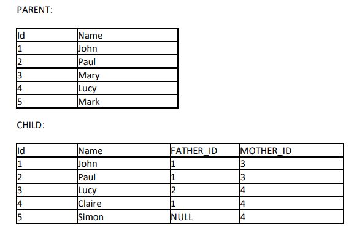

## Resumo do Projeto

### Objetivo da API

Suponha um sistema com duas tabelas, PARENT e CHILD, com o seguinte conteúdo:

Escreva SpringBoot WebMVC REST Service que retorna:

1. Uma lista de todos os nomes do PAI
2. Todos os nomes de PAI que têm mais de um filho
3. Para cada CRIANÇA, o nome do pai e da mãe, se definido
4. Quantos filhos John tem
5. Quantos filhos Maria tem

### Especificação técnica da API.

A API foi construída com Java 11, SpringBoot, Maven e para comunicação das APIS utilizamos o RestTemplate do springBoot.

Iniciar o docker:  
 - docker-compose up -p

Encerrar o docker:  
 - docker-compose down 

#### Utilizado o Swagger para testar a API:
* http://localhost:8080/swagger-ui/index.html#/

#### Acesso ao banco de dados:
* http://localhost:3306/demo